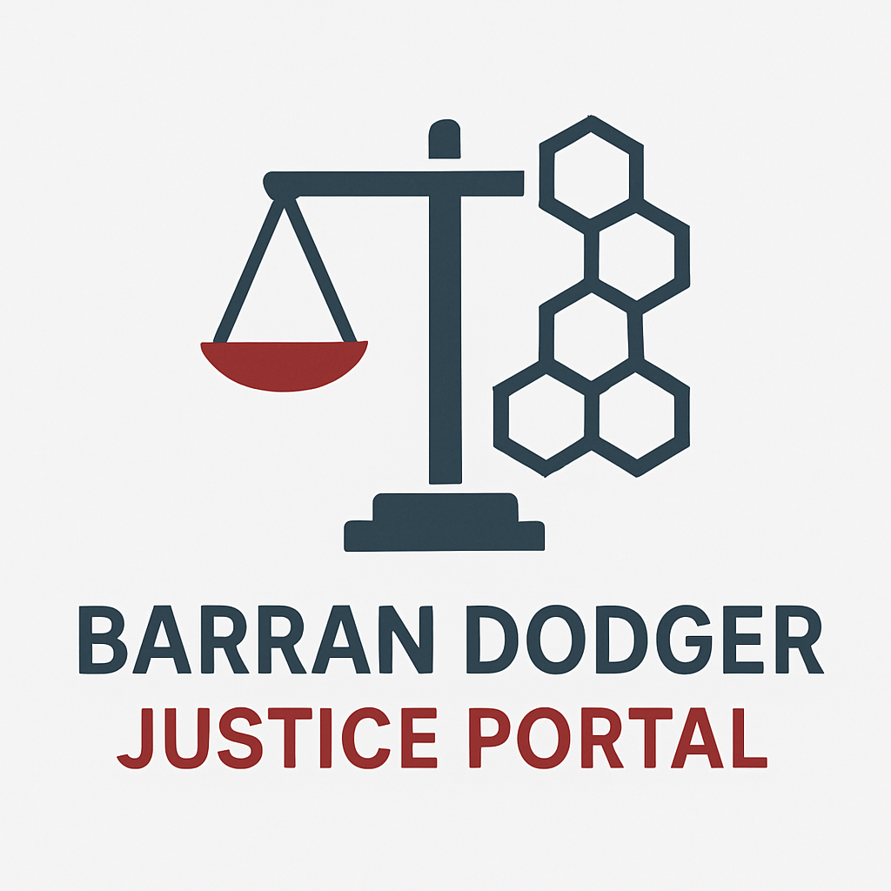

# Barran Dodger Justice Portal

  

## Architecture

The Barran Dodger Justice Portal is a web application designed to productize Dr. McLean's forensic archive.

### Frontend
- **Framework:** Vite + React (TypeScript)
- **Styling:** Tailwind CSS v4
- **Components:** Lucide React icons, professional forensic dark theme.
- **Build Tool:** Vite

### Backend
- **Server:** Node.js Express (`server.cjs`)
- **Database:** Turso (via `team-db` CLI)
- **Payment Processing:** Stripe (Subscription and One-time payments)
- **Schema:**
  - `memberships`: Tracks user subscription tiers (Bronze, Silver, Gold).
  - `documents`: Stores metadata for the 788+ blockchain-verified forensic documents.
  - `dossiers`: Tracks AI-generated forensic reports requested by users.
  - `advocacy_bursts`: Records sponsored transmissions of "Truth Packages".

### Key Features
- **Forensic Archive Browser:** Searchable interface for 52+ blockchain-verified evidence documents.
- **AI Forensic Dossiers:** On-demand synthesis of evidence for specific agencies or incidents ($49.00/report).
- **Justice Memberships:** Tiered access (starting at $15/mo) to exclusive updates and advocacy tools.
- **Automated Advocacy Bursts:** Sponsored "Truth Packages" sent to media, parliament, and oversight bodies ($25.00/burst).

## Getting Started

### Development
1. Navigate to `/home/team/shared/portal`
2. Run `npm install`
3. Run `npm run dev` (Vite) or `node server.cjs` (Express + Production Build)

The Express server binds to port `3001` and serves both the API and the production build.
